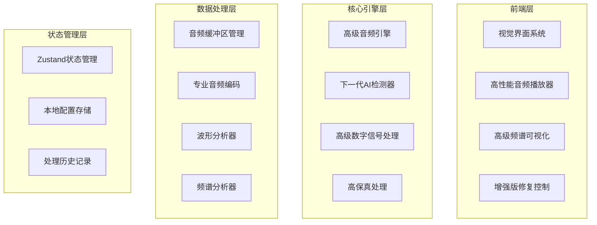

## 1. Architecture Design


## 2. Technology Description
- Frontend: React@18 + TypeScript + Vite
- State Management: Zustand
- Styling: Tailwind CSS + Custom CSS Animations
- Audio Processing: Web Audio API + Custom DSP Algorithms
- Visualization: Canvas API + Web Audio Analyser
- AI Detection: Multi-dimensional Feature Analysis + Neural Network-inspired Scoring

## 3. Route Definitions
| Route | Purpose |
|-------|---------|
| / | 主界面 - 下一代AI音乐修复中心 |

## 4. Core Modules

### 4.1 下一代AI检测器
- **20+维音频特征分析**: 频谱熵、动态范围、相位一致性、谐波畸变、噪音门水平、时间熵、频谱带宽、瞬态分析等
- **AI生成检测算法**: 基于统计分析和特征匹配，识别典型AI生成音频特征
- **可信度评分**: 多重验证机制，提高检测准确率
- **实时分析**: 在音频上传后立即执行AI检测分析

### 4.2 高级音频修复引擎
- **智能削波检测与修复**: 高精度检测，平滑修复
- **多频段去噪**: 选择性降噪，保留音质
- **毛刺/爆音消除**: 定位算法 + 插值修复
- **智能人声增强**: EQ优化 + 清晰度提升
- **谐波增强器**: 自然泛音重建
- **动态范围处理**: 专业压缩器 + 自动增益控制

### 4.3 高保真导出系统
- **采样率**: 44.1kHz, 48kHz, 96kHz, 192kHz支持
- **位深**: 16-bit, 24-bit, 32-bit float
- **格式**: WAV, AIFF, FLAC (导出选项)
- **元数据**: 保留并增强音频元数据

### 4.4 组件结构
```
src/
├── components/
│   ├── NeonUploader.tsx       # 霓虹风格上传组件
│   ├── AdvancedWaveform.tsx   # 高级波形可视化
│   ├── SpectrumAnalyzer.tsx   # 频谱分析器
│   ├── AIDetectionPanel.tsx   # AI检测面板
│   ├── RepairCenter.tsx       # 修复中心面板
│   ├── ControlSlider.tsx      # 精致控制滑块
│   ├── PresetCards.tsx        # 预设卡片
│   └── ExportSettings.tsx     # 导出设置
├── hooks/
│   ├── useNextGenProcessor.ts # 下一代处理钩子
│   ├── useAIDetector.ts       # AI检测器钩子
│   └── useAudioState.ts       # 音频状态管理
├── utils/
│   ├── audioDetectionV2.ts    # 新一代AI检测算法
│   ├── advancedRepair.ts      # 高级修复算法
│   ├── highResExport.ts       # 高保真导出
│   ├── visualEffects.ts       # 视觉效果库
│   └── animationUtils.ts      # 动画工具函数
├── store/
│   └── useAppStore.ts         # Zustand状态管理
└── App.tsx                    # 主应用组件
```

### 4.5 状态管理 - Zustand
```typescript
interface AppState {
  audioFile: File | null
  originalBuffer: AudioBuffer | null
  processedBuffer: AudioBuffer | null
  isProcessing: boolean
  aiDetectionResult: {
    aiProbability: number
    humanProbability: number
    features: Record<string, number>
    detectedIssues: string[]
  } | null
  repairParams: AdvancedRepairParams
  exportOptions: ExportOptions
  playMode: 'original' | 'processed'
  isPlaying: boolean
  currentTime: number
  duration: number
  
  actions: {
    setAudioFile: (file: File | null) => void
    setOriginalBuffer: (buffer: AudioBuffer | null) => void
    setProcessedBuffer: (buffer: AudioBuffer | null) => void
    setIsProcessing: (processing: boolean) => void
    setAIDetectionResult: (result: any) => void
    updateRepairParam: (key: keyof AdvancedRepairParams, value: number) => void
    setPlayMode: (mode: 'original' | 'processed') => void
    togglePlay: () => void
    applyRepair: () => Promise<void>
    exportAudio: () => Promise<void>
  }
}
```

## 5. 技术特点

### 5.1 性能优化
- Web Worker 后台处理
- 增量分析计算
- 高效的内存管理
- 优化的音频解码和编码

### 5.2 视觉与交互
- Canvas 高性能可视化
- CSS Animation + JavaScript 动画组合
- 响应式 + 性能优化并重
- 精致的微交互设计
- 平滑的视觉过渡

### 5.3 检测与修复算法亮点
- **频谱分析**: STFT (Short-time Fourier Transform) 精确分析
- **时间序列**: 时间熵、动态范围、瞬态检测
- **多维度**: 20+特征综合评分
- **修复精度**: 精确到采样级别的定位修复
